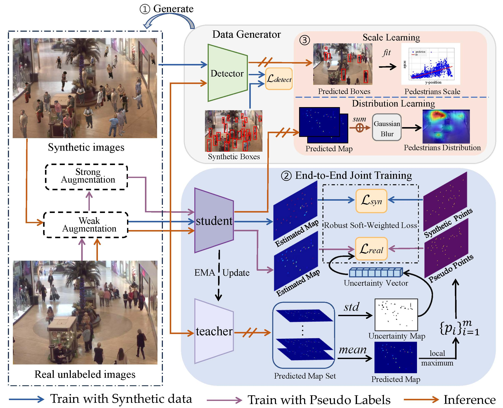

# Learning Crowd Scale and Distribution for Weakly Supervised Crowd Counting and Localization (TCSVT)
## Introduction
This is the official PyTorch implementation of paper: [Learning Crowd Scale and Distribution for Weakly Supervised Crowd Counting and Localization](https://ieeexplore.ieee.org/abstract/document/10680129) (extended from paper [Weakly-supervised scene-specific crowd counting using real-synthetic hybrid data](https://ieeexplore.ieee.org/abstract/document/10095275)). This paper proposes a weakly supervised crowd counting and localization method  based on scene-specific synthetic data for surveillance scenarios, which can accurately predict the number and location of person without any manually labeled point-wise or count-wise annotations.



# Catalog
✅ MovingDroneCrowd

✅ Training and Testing Code for SDNet

✅ Pretrained models for MovingDroneCrowd

# Getting started

## preparatoin
* Clone this repo in the directory 

* Install dependencies. We use python 3.7 and pytorch == 1.10.0 : http://pytorch.org.

    ```bibtex
    conda create -n LCSD python=3.7
    conda activate LCSD
    conda install pytorch==2.4.1 torchvision==0.19.1 torchaudio==2.4.1 pytorch-cuda=12.4 -c pytorch -c nvidia
    cd ${MovingDroneCrowd}
    pip install -r requirements.txt
    ```
* Datasets

First build the resources folder used by the code. The folder organization is illustrated below:

```bibtex
$resources/
├── CityUHK-X
│   ├── scene_001
│   │   ├── CityUHK-X_scene_001_20_40
│   │   │   ├── train_data
│   │   │   │   ├── images
│   │   │   │   │   └── xx.jpg
│   │   │   │   ├── ground_truth_txt
│   │   │   │   │   └── xx.txt
│   │   │   ├── test_data
│   │   │   ├── train_data.txt
│   │   │   └── test_data.txt
│   │   └── scene.jpg
│   ├── scene_002
│   ├── ...
│   └── scene_k
├── Mall
│   ├── scene_001
│   │   ├── mall_800_1200
│   │   │   ├── train_data
│   │   │   │   ├── images
│   │   │   │   │   └── xx.jpg
│   │   │   │   ├── ground_truth_txt
│   │   │   │   │   └── xx.txt
│   │   │   ├── test_data
│   │   │   ├── train_data.txt
│   │   │   └── test_data.txt
│   │   └── scene.jpg
├── UCSD
│   ├── scene_001
│   │   ├── ucsd_800_1200
│   │   │   ├── train_data
│   │   │   │   ├── images
│   │   │   │   │   └── xx.jpg
│   │   │   │   ├── ground_truth_txt
│   │   │   │   │   └── xx.txt
│   │   │   ├── test_data
│   │   │   ├── train_data.txt
│   │   │   └── test_data.txt
│   │   └── scene.jpg
├── pedestrians
│   ├── GCC
│   │   └── xx.png
│   ├── SHHB
│   └── LSTN
├── indoor_negetive_samples
│   └── xx.jpg
├── outdoor_negetive_samples
│   └── xx.jpg
└── net_G_last.pth.txt
```

    ◦ **Mall**: Download Mall dataset from this [link](https://personal.ie.cuhk.edu.hk/~ccloy/downloads_mall_dataset.html).

    ◦ **UCSD**: Download frames data dataset from [link](http://visal.cs.cityu.edu.hk/static/downloads/ucsdpeds_vidf.zip) and annotations from [link](http://www.svcl.ucsd.edu/projects/peoplecnt/db/vidf-cvpr.zip). Frames in folder `vidf1_33_000.y` – `vidf1_33_009.y` in total 2000 frames are used (only this part has coordinates labels). In out settings, `vidf1_33_003.y` – `vidf1_33_006.y` are used for predicting pseudo labels, and `vidf1_33_00.y` – `vidf1_33_002.y` and `vidf1_33_009.y` – `vidf1_33_009.y`are used for test.

    ◦ **CityUHK-X**: Download CityUHK-X dataset from this[link](http://visal.cs.cityu.edu.hk/static/downloads/CityUHK-X.zip)

## Training

Check some parameters in `config.py` before training:

* Use `__C.DATASET = 'MovingDroneCrowd'` to set the dataset (default: `MovingDroneCrowd`).
* Use `__C.NAME = xxx` to set the name of the training, which will be a part of the save directory.
* Use `__C.PRE_TRAIN_COUNTER` to set the pre-trained counter to accelerate the training process. The pre-trained counter can be download from this [link](https://drive.google.com/file/d/1ILLLMM3vDIm773XNOerj8rQH-DCQYzRA/view?usp=drive_link).
* Use `__C.GPU_ID = '0'` to set the GPU. You can set `__C.GPU_ID = '0, 1, 2, 3'` if you have multiple GUPs.
* Use `__C.MAX_EPOCH = 100` to set the number of the training epochs (default:100). 
* Set dataset related parameters (`DATA_PATH`, `TRAIN_BATCH_SIZE`, `TRAIN_SIZE` etc.) in the `datasets/setting`.
* run `python train.py` for one GPU, or run `torchrun --master_port 29515 --nproc_per_node=4 train.py`for multiple GPUs. (for example, 4 GPUs)

Tips: The training process takes ~12 hours on `MovingDroneCrowd` dataset with two A800 (80GB Memory).

## Test

<!--To reproduce the performance, download the pre-trained models from [Google Drive]() and then place pretrained_model files to `SDNet/pre_train_model/`. -->
Check some parameters in `test.py` before test:

* Use `DATASET = MovingDroneCrowd` to set the dataset used for test.
* Use `test_name = xxx` to set a test name, which will be a part of the save director of test reults.
* Use `test_intervals = 4` to set frame interval for test (default `4` for `MovingDroneCrowd`). 
* Use `model_path = xxx` to set the pre-trained model file.
* Use `GPU_ID = 0` to set the GPU used for test.
* run `test.py`

# Citation
If you find this project is useful for your research, please cite:

```bibtex
@ARTICLE{LCSD,
  author={Fan, Yaowu and Wan, Jia and Ma, Andy J.},
  journal={IEEE Transactions on Circuits and Systems for Video Technology}, 
  title={Learning Crowd Scale and Distribution for Weakly Supervised Crowd Counting and Localization}, 
  year={2025},
  volume={35},
  number={1},
  pages={713-727}
  }

@INPROCEEDINGS{ICASSP_2023_FAN
  author={Fan, Yaowu and Wan, Jia and Yuan, Yuan and Wang, Qi},
  booktitle={IEEE International Conference on Acoustics, Speech and Signal Processing (ICASSP)}, 
  title={Weakly-Supervised Scene-Specific Crowd Counting Using Real-Synthetic Hybrid Data}, 
  year={2023},
  pages={1-5}
}


 ```

# Acknowledgement

The released PyTorch training script borrows some codes from the [DRNet](https://github.com/taohan10200/DRNet). If you think this repo is helpful for your research, please consider cite them.